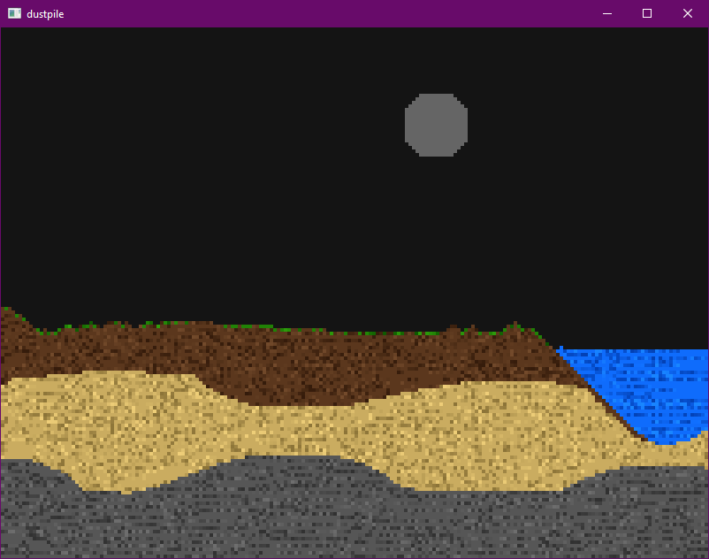

<div align="center">
    <h1><code>dustpile</code></h1>
    GPU falling sand sim in Zig 
    <hr>
</div>

WIP. Uses [generated OpenGL bindings](https://github.com/MasterQ32/zig-opengl) to interact with the GPU. 

```
- B : Change brush size
- Space : Pause / Resume simulation
- P : Step simulation
```


